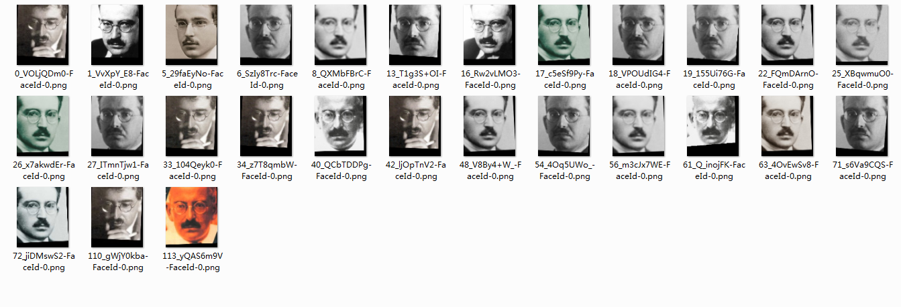
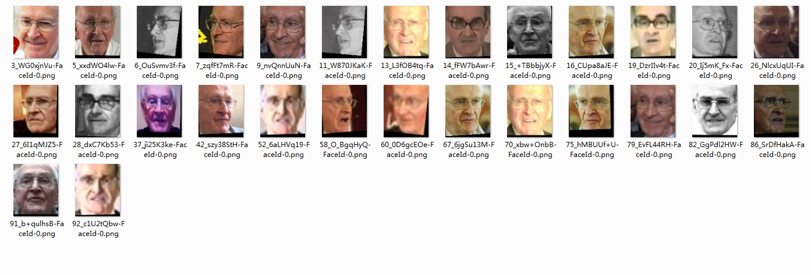
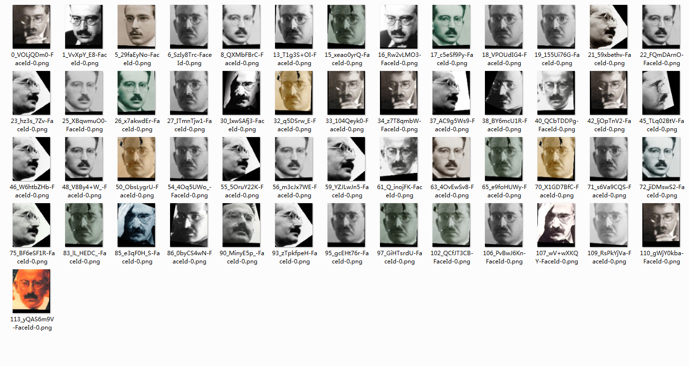

# RSA pycaffe

pycaffe port of RSA([Recurrent Scale Approximation for Object Detection](https://github.com/sciencefans/RSA-for-object-detection))

# Updata 2017/12/12
### aligned images with (ec-mc-y= 40,size=[96,112]) using MTCNN & RSA

### MTCNN:

### RSA:

# Usage
1.download matlab version of RSA

2.copy RSA.py,nms.py to ./predict/

3.make pycaffe under your_caffe_path

4.change the caffe_root in RSA.py to your_caffe_path/python

5.create a sample of RSA,e.g,rsa = RSA()

6.call function detect

	input param:image
	output param:score,box,pts
e.g

	img = cv2.imread(img_path,1)
	score,box,pts = rsa.detect(image)

### update 2017/12/9:

7.For multiGPUs:

1)Change work function in Work.py to what you want

2)run. e.g:

	import Multi_GPUs
	list = ['1.jpg','2.jpg','3.jpg']
	gpu_ids = [0,1,2]
	multiprocess(list,gpu_ids)

# Attention

There will be some different while using imread between opencv and matlab.The pixel value will be different if you use opencv version hight than opencv2.4.

# Thanks

my friend and pre-fellow @Dickachu Yang helps me a lot on python numpy module

His pycaffe port of RSA:

[https://github.com/power0341/RSA_pycaffe](https://github.com/power0341/RSA_pycaffe)

# Ps:

my first python code,very ugly.

A lot of thing to learn with python and numpy ^_^